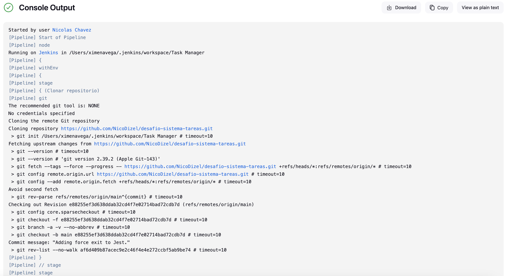
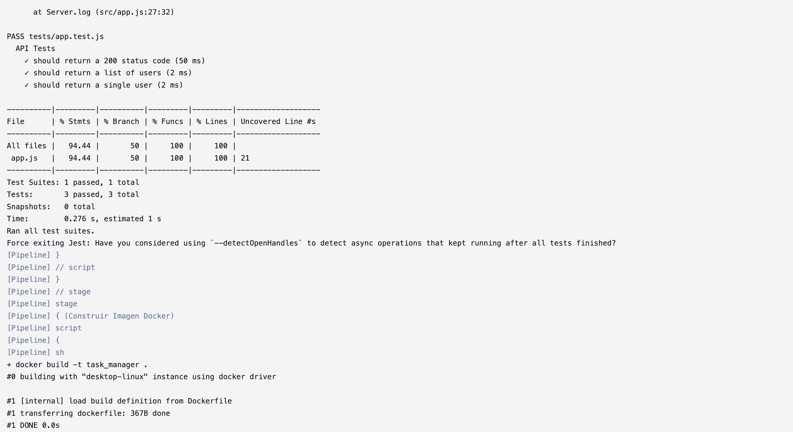
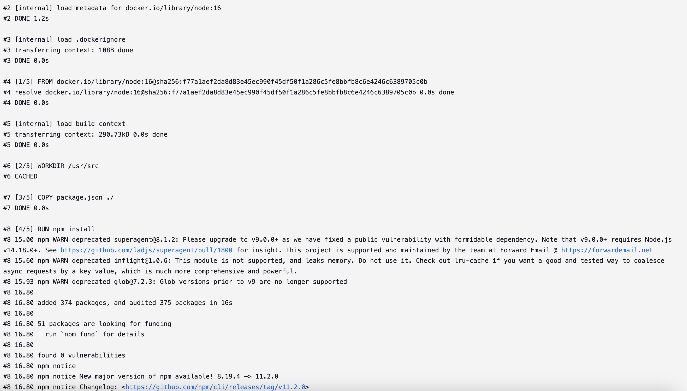
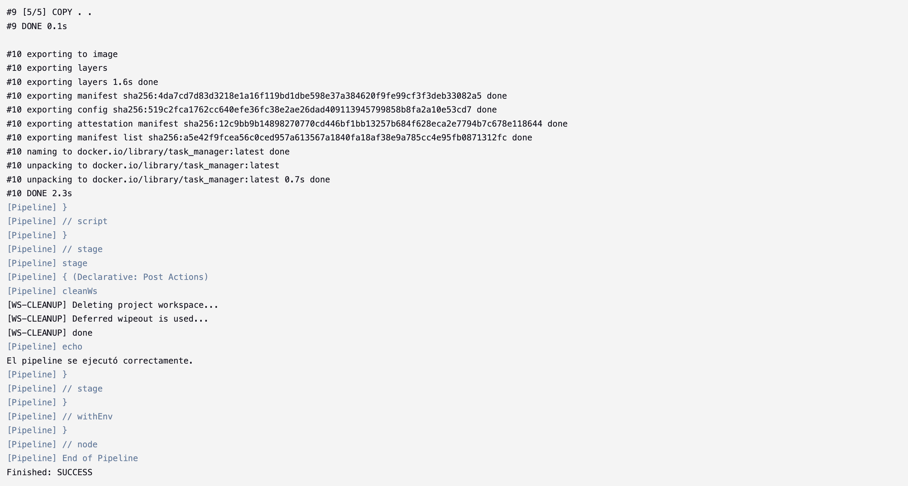

# Sistema de gestión de tareas / Desafío módulo 8
Integrantes:

- Eduardo Hernández
- Nicolás Chávez

Un reporte del paso a paso se puede encontrar en REPORT.md. Además se deja evidencia de los resultados obtenidos del terminal de Jenkins y el uso de los endpoints.

### Pipeline Jenkins


```groovy
pipeline{
    agent any
    
    environment {
        DOCKER_IMAGE_NAME = "task_manager"
        REPO_URL = "https://github.com/NicoDizel/desafio-sistema-tareas.git"
    }
    
    stages {
    
        stage('Clonar repositorio') {
            steps {
                //Clonar repositorio
                git url: "${REPO_URL}", branch: 'main'
            }
        }
        
        stage('Instalar dependencias') {
            steps {
                script {
                        try {
                            // Instalamos las dependencias de Node.js
                            echo "Instalando dependencias... "
                            sh 'npm install'
                            
                        } catch (Exception e) {
                            error("Error en la instalación de dependencias", e)
                        }
                    }
                }
        }
        
        stage('Ejecutar pruebas') {
            steps {
                script {
                        // Ejecutamos las pruebas...
                        echo "Ejecutando pruebas... "
                        sh 'npm test'
                    }
                }
        }
        
        stage('Construir Imagen Docker') {
            steps {
                script {
                    // Construir la imagen Docker desde el Dockerfile
                    sh """
                        docker build -t ${DOCKER_IMAGE_NAME} .
                    """
                    }
                }
            }
        }
    post {
        always {
            cleanWs() // Limpiar el espacio de trabajo de Jenkins
        }

        success {
            echo "El pipeline se ejecutó correctamente."
        }

        failure {
            echo "El pipeline falló. Revisa los logs."
        }
    }
}
```

### Terminal




